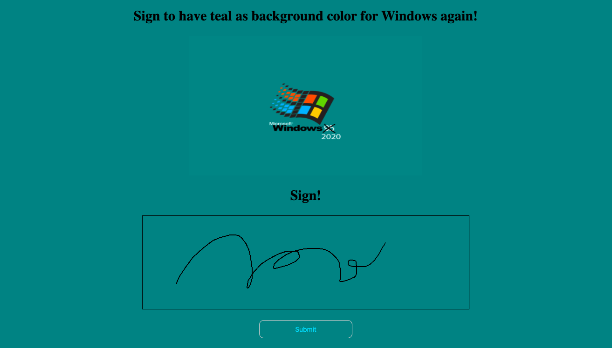

# Petition Project

https://petitionproject.herokuapp.com/register

## Summary

This web petition application made during my Fullstack Web Dev intensive course at SPICED academy. An user should register to the plattform add their info, sign for the petition, change their signature.

## Technologies

- JavaScript
- Node.js
- Express.js
- SQL

## Feautures

- Registration
- Log in
- Sign (Canvas)
- Delete their signature
- See other users
